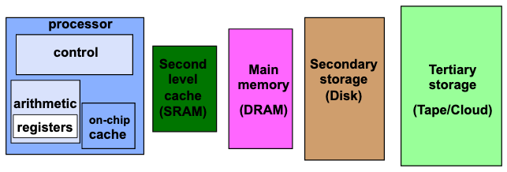
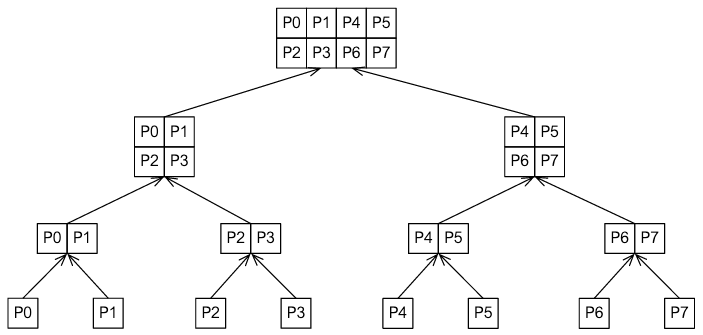
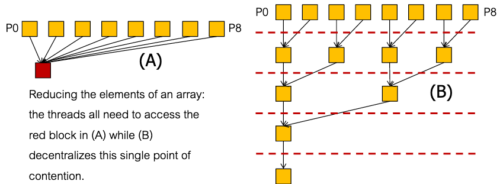
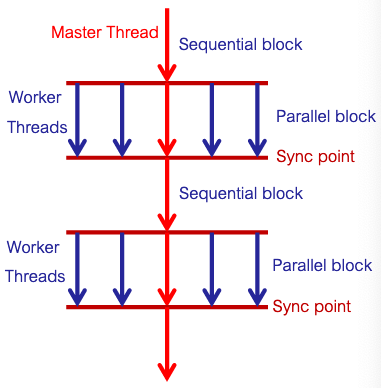

# Condensed notes for midterm

## Single processor machines

### Compiler optimization

compiler performs many optimizations

- improve register reuse/optimize away unneeded variables
- interchange loops
- unroll loops

### Memory hierarchy



### Cache and locality

- cold vs warm cache:
  - cold cache: data in the cache is stale, need to read from memory
  - warm cache: relevant data in cache
  - running code multiple times can help performance because it warms up cache
- **false sharing**
  - if `[x, y, z]` is an array, processor 1 accesses `x`, and processor 2 accesses `y`, then both have entire array in cache line
  - if processor 1 updates `x`, then processor 2 needs to fetch the cache line again even though it doesn't need `x`

## Parallel algorithm design

### Task decomposition

- divide the program into *tasks* that can be executed in parallel
- a **task** is a unit of computation in the program that can be assigned to a process and run concurrently with other tasks
  - i.e. independent chunks of work
- **granularity** is determined by how many tasks there are and how small these tasks are
- parallelism granularity is how much processing is performed before communication is necessary between processes
- the maximum/average **degree of concurrency** is the maximum/average number or weight of tasks that can be executed concurrently
  - the maximum degree is the maximum sum of nodes at a single level in a task dependency graph
- the **critical path** of a program is the longest path between any pair of start and finish nodes in a program's task dependency graph
  - the length of this path is the sum of the weights of the nodes in the path
  - the average degree of concurrency is the total amount of work divided by the length of the critical path

### Task mapping

- **task mapping** is assigning tasks to processes
- a good mapping
  - maximizes use of concurrency
    - minimize **idle time**
  - minimizes program completion time
  - minimizes interaction between processes
- **recursive decomposition** divides program into tasks by turning each step of program into divide and conquer problem, maps divided tasks to different processes
- **data decomposition** divides data into separate chunks, and this can induce a task mapping
  - could do this in different ways
    - partition input data
    - partition output data
    - partition both

### Static mapping

**static mapping** is when tasks are assigned to processes before execution

- e.g. by programmer
- must have good knowledge of program, data, interactions, programming paradigm for effective static mapping
- usually done with uniform partitioning of data
- NP-complete in general (so need good heuristics)

static mapping schemes:

1. data partitioning
   - arrays are generally regular and dense, so can create tasks by splitting array into chunks
     - map tasks to processes essentially by mapping data to them
   - graphs are generally sparse and irregular so more difficult
2. task partitioning
   - partition task dependency graph
   - map nodes of dependency graph to processes
   - optimal mapping is NP-complete
3. hierarchical mapping
   - if the task dependency graph is a tree, then there is a clear hierarchy but bad concurrency near/at the root
   - can solve this by dividing larger tasks into subtasks which are mapped to different processes, so each height of tree still has good concurrency



### Dynamic mapping

**dynamic mapping** is when tasks are assigned to processes during execution

- a common strategy is a **task pool**, a queue of tasks
  - processor takes a new task from queue whenever it is idle

### Decreasing interaction overhead

- maximizing data locality
  - minimize volume of shared data
  - use local data to store intermediate results, rather continuously updating global data
  - minimize interactions by using large chunks of shared data
- minimize contention and hot spots
  - **contention** is concurrent accesses to the same memory block
    - might require synchronization
    - might cause false sharing
  - can solve by reordering accesses
  - can also solve by decentralizing shared data
    
- overlapping computations with interactions
  - interactions require waiting, but processes don't have to idle while waiting
  - can do computations while waiting
  - one strategy is to initiate interaction earlier than necessary and continue computation while waiting
  - another strategy is to grab more tasks in advance, switch between computations while waiting
  - may be supported in software or hardware
  - more applicable to distributed/GPU architectures than shared memory models
- replicating data/computations
  - replicate shared data so that there is no interaction, so no contention
  - works well when shared data is read-only
  - increases overall memory usage due to replication
  - if shared data is not read-only, then upholding coherence might be difficult and negate benefits

### Parallel algorithm models

A model consists of a decomposition method, a task mapping method, and strategies to minimize interactions

- **data parallel model**
  - static uniform data partitioning
  - static mapping
    - make use of data parallelism - perform same operations on multiple data items
  - can optimize by
    - decomposing data in a way that preserves locality
    - overlapping computation with interaction
  - this model scales well when we add more processors
- **task graph model**
  - use knowledge of task dependencies from dependency graph to increase locality/reduce interaction
  - recursive or graph-based data partitioning
  - static or dynamic mapping, but try to keep tasks independent
  - can optimize by
    - maximizing locality by minimizing non-local accesses/interactions
    - overlapping computation with interaction
  - works much better in shared address space than distributed
  - e.g. merge sort
- **work pool model**
  - tasks are taken by processes from common queue
  - decomposition depends on problem
  - mapping is dynamic, by virtue of queue
  - main strategy for reducing interaction is adjusting granularity of tasks in work pool
  - this has tradeoff:
    - larger and fewer tasks means less interaction
    - smaller and more tasks means less idle time
- **manager-worker model**
  - used in distributed architectures
  - manager process generates work and allocates to workers
  - decomposition depends on problem
  - mapping generally dynamic
  - can optimize by:
    - choosing granularity carefully
      - too high granularity makes manager a bottleneck
      - manager generating tasks overlaps with workers doing computations

## Measuring performance

- common sources of overhead:
  - communication
  - idling
  - excess computation (sometimes added to reduce communication)
- speedup $S = T_s / T_p$
  - $T_s$ is time that serial program takes
  - $T_p$ is time that $p$ processors take
- linear speedup is when $S \sim p$
- superlinear speedup only happens when sequential algorithm is at a disadvantage

#### Amdahl's law

- let $T$ and $T'$ be the running time of a program before and after enhancement

- $T = T_1 + T_2$
  - $T_1$ is time taken by part of program that is necessarily sequential
    - can't be enhanced by parallelization
  - $T_2$ is time taken by part of program that can be parallelized
    - can be enhanced
  
- $T' = T_1 + T_2'$

  - enhanced program has $T_2' \leq T_2$, but cannot improve $T_1$
  - perfect speedup means dividing $T_2$ work among $p$ processors equally and without overhead, i.e. $T_2' = T_2 / p$
  - as a result, considering the real $T_2'$, we have $T_2' \geq T_2 / p$

As a result, if $T = 1$ then speedup is
$$
S = \frac{T}{T'} = \frac{1}{T_1 + T_2'} \leq \frac{1}{T_1 + T_2/p} \leq \frac{1}{T_1}
$$

(this holds if $T \neq 1$ but $T_1$ is the *percentage* of time spent on the necessarily sequential part)

### Efficiency

**efficiency** is $E = S/p$, the fraction of time when processes are doing useful work

- $E \in [0, 1]$

### Bad ways to report improvements from parallelization

the following are bad and will cause misleading numbers when performing measurements:

- use different architecture for serial/parallel
- use a bad algorithm for serial instead of optimizing serial first
- use a bad implementation for the serial code
- report speedup but not running times

## Shared memory architectures

- a **programming model** is made of languages and libraries that create abstractions on the machine hardware
  - e.g. threads
- programming model allows us to work with:
  - control over parallelization
    - threads
    - ordering
    - tasks
  - data
    - which data is private/shared
    - how data is communicated
  - synchronization
    - which operations can be used for synchronization
    - which operations are atomic

### Shared memory programs

- program consists of threads (which can be created during execution)
- each thread has private (local) variables, all threads share some variables
  - reading/writing shared variables is *communication*

### Pthreads

- pthreads supports:
  - creating parallelism (spawning threads)
  - synchronization
  - shared memory
- since there is shared memory, there is no need for explicit communication constructs

Pthreads example:

```c
#include <stdio.h>
#include <pthread.h>

// thread function:
void *funnyguy(void *arg) {
    char *s = (char *)arg;
    printf("%s funny guy\n", s);
    return NULL; // necessary
}

int main() {
    // to spawn a thread:
    pthread_t thread;
    char *ala = "ala";
    // second arg is usually just NULL
    int errcode = pthread_create(&thread, NULL, funnyguy, ala);
    // waits for thread to be done
    pthread_join(thread, NULL);
}
```

### Synchronization

- a **race condition** is when the outcome of the program depends on the order in which threads happen to access a variable (i.e., not in a controlled way)
  - can happen when processes share variables without synchronization
- synchronization can prevent race conditions because it can make sure that only one thread accesses a variable at a time
- **critical section** is the part of code that accesses shared resources
  - part of code that needs to be synchronized so that multiple threads are not in it at once
- want to ensure that:
  - only one thread in critical section at a time
  - other threads have to wait for critical section
  - when one thread leaves, another thread can enter

#### Mutexes/locks

- **mutex** = **mut**ual **ex**clusion
- threads try to acquire lock, wait if it is busy, enter critical section when not busy, then release when exiting critical section
- **deadlock** is mutual blocking of threads/processes
  - happens when different threads try to acquire lock, but neither can advance unless the other does, so they are stuck waiting
  - can happen with bad lock order, multiple locks in bad order, etc
- locks are slow
  - waiting to acquire takes time
  - overhead
- should use synchronization sparingly

Pthreads mutex example:

```c
#include <stdio.h>
#include <pthread.h>

pthread_mutex_t lock;

void *lockfunc() {
    pthread_mutex_lock(&lock);
    printf("congratu");
    printf("lations!\n");
    pthread_mutex_unlock(&lock);
    return NULL;
}

int main() {
	pthread_mutex_init(&lock, NULL);
    pthread_t threads[5];
    for (int i = 0; i < 5; i++) {
        pthread_create(&threads[i], NULL, lockfunc, NULL);
    }
    for (int i = 0; i < 5; i++) {
        pthread_join(threads[i], NULL);
    }
}
```

#### Barriers

- construct for threads
- once a thread reaches a barrier, it waits until the rest of the threads have reached the barrier, then they all continue

Pthreads barrier example: (doesn't run on MacOS)

```c
#include <stdio.h>
#include <pthread.h>

pthread_barrier_t barrier;

// thread function:
void *sad() {
    // every thread is excited to go to uoft
    printf("i am so excited to go to uoft\n");
    // then they get there
    pthread_barrier_wait(&barrier);
    // now they are sad
    printf("i am so sad\n");
    return NULL; // necessary
}

int main() {
    int num_threads = 5;
    pthread_barrier_init(&barrier, NULL, num_threads);
    pthread_t threads[num_threads];
    for (int i = 0; i < num_threads; i++) {
        pthread_create(&threads[i], NULL, sad, NULL);
    }
    for (int i = 0; i < num_threads; i++) {
        pthread_join(threads[i], NULL);
    }
    pthread_barrier_destroy(*barrier);
}
```

## OpenMP

- pthreads is hard to program with

- OpenMP is meant to simplify parallel programming for common usage

- uses mostly preprocessor directives (start with `#pragma`)

- allows programmer to separate program into serial and parallel regions rather than explicitly programming threads

- follows fork-and-join execution model

  

- need to compile with `-fopenmp` flag

- number of threads is generally decided by `OMP_NUM_THREADS` environment variable

  - default value is max number of threads supported by computer
  - can also be set with library functions

- library functions:

  - `int omp_get_num_threads()`
  - `void omp_set_num_threads(n)`
  - `int omp_get_max_threads()`
  - `int omp_get_thread_num()`
  - `int omp_get_num_procs()`
    - number of processors
  - `int omp_in_parallel()`
    - 0 if outside a parallel region, nonzero otherwise
  - `double omp_get_wtime()`
    - clock time in seconds for current thread

- preprocessor directives come after `#pragma omp`

- options for `#pragma omp parallel`:

  - `parallel if(condition)`
    - only parallelizes code if `condition` is true
  - `parallel num_threads(n)`
    - parallelizes with `n` threads instead of `OMP_NUM_THREADS`
  - `parallel private(variable)`
    - gives each thread an uninitialized private copy of `variable`
  - `parallel firstprivate(variable)`
    - gives each thread a private copy of `variable` that still has the current value
  - `parallel shared(variable)`
    - allows all threads to share `variable`
  - `parallel default(setting)`
    - `setting` can be `none`, `private`, `shared`
      - if `none`, must explicitly decide sharing for each variable in parallel region
      - best to use `none` for that reason
  - `reduction(op:variable)`
    - `op` must be one of `+`, `*`, `-`, `&`, `|`, `^`, `&&`, `||`
    - e.g. `#pragma omp reduction(+:s)`
    - each thread keeps a local copy of `variable`, which is reduced to one variable using `op` at the end
  - `for`
    - automatically splits iterations of `for` loop among threads
    - since threads will run independently, should not use this when order matters
      - i.e. should not use for a `for` loop where each iteration depends on work done in previous iterations
    - must have a normal for loop
      - iterator is integer
      - starts at integer
      - use `<`, `>`, `<=`, or `>=` in condition
      - must increment by an integer

- scheduling

  - decide how iterations are mapped to threads with `schedule(class[, param])` in `for` directive
    - `static`: each thread does a constant number of iterations
    - `dynamic`: queue of iterations, thread takes from queue whenever it is ready
    - `guided`: assign large chunks of iterations to threads at beginning, but assign smaller ones as computation progresses
      - This way, not much communication at beginning, and not much load imbalance at end
    - `runtime`: delay scheduling decision until runtime, use `OMP_SCHEDULE` environment variable
  
- barriers

  - `omp for` directives implicitly have a barrier after the for loop
    - we can remove this barrier using the `nowait` option
  - can add explicit barrier in parallel region with `#pragma omp barrier`

- sections and tasks

  - can use `#pragma omp section` to define a section of code
  - has an implicit barrier at the end, so each thread finishes section, then all threads move on
  - can use `#pragma omp task` to define sections without implicit barrier

- single and master

  - sometimes want only one thread to execute some code
  - `#pragma omp single` block if any thread can execute it
    - implicit barrier after
  - `#pragma omp master` block if only master thread should execute it
    - no implicit barrier after

- critical sections and atomic

  - use `#pragma omp critical` to mark that some code should only be executed by one thread at a time
  - use `#pragma omp atomic` to do the same when setting a variable
    - has hardware support
    - e.g. `data += 5;` can be atomic

- OpenMP has explicit locks but who cares

Simple OpenMP example:

```c
#include <omp.h>

int main() {
    char *y_or_n;
    if (omp_in_parallel())
        y_or_n = "yes";
    else
        y_or_n = "no";
    printf("am i in a parallel region yet? %d", y_or_n);
    
    int n = omp_get_num_threads();
    int s = 0;
    #pragma omp parallel reduction(+:s) firstprivate(n)
    {
        int id = omp_get_thread_num();
        printf("thread %d of %d", id, n);
        s += id;
    }
    printf("sum of numbers from 0 to %d is %d", n - 1, s);
    
    #pragma omp parallel for
    for (int i = 0; i < 10; i++)
        do_work(i);
}
```

